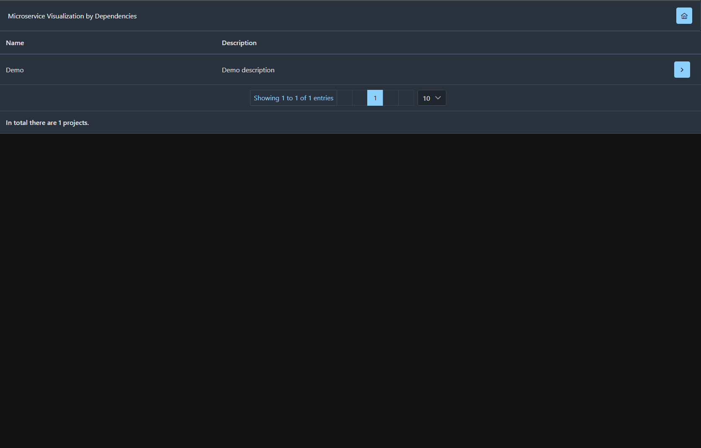

# Microservice Visualization by Dependencies

[](https://github.com/rbaul/microservice-visualization/actions/workflows/gradle.yml)
[](https://github.com/rbaul/microservice-visualization/actions/workflows/docker-image.yaml)

## Live
> * [Live demo](https://microservice-visualization.glitch.me/)
> * [Demo project](https://github.com/rbaul/microservice-visualization-demo-project)

All Spring Boot (Java) applications has dependencies to other applications, that mean has some library of DTO (Data transfer Object) that common use in all applications that communicate with specific application. This way we can create microservice topology.
#### Example
> * Application: customer 
> * DTO library: customer-api

## Support
> * Gradle 
> * Maven (TODO)

## Build on
* Java 21, Framework Spring Boot 3.2.x
* Angular 17.0.x, PrimeNG
* Gradle 8.5.0

#### Microservice architecture demo
> * Example of microservice project [Demo Project](demo)  
> * Execute Gradle task `createDependecyFile`, see [Output folder](result)  
> * Execute `MicroserviceVisualizationApplication.java` for run Backend  
> * Execute `dev` script of [microservice-visualization-webapp](microservice-visualization-webapp)  

##### Demo


##### Dev Run
```
spring.profiles.active=dev
```

##### Directory Structure of the project
See [Demo Project](docker/demo-project)
```
    .
    ├── 1.0.0                               # Version folder
    |   ├── applications                    # Applications folder of the project
    |   |   ├── application1.json           # Application dependcy json
    |   |   ├── ...                 
    |   |   └── applicationN.json
    |   ├── libraries                       # Libraries folder of the project
    |   |   ├── library1.json               # Library dependcy json
    |   |   ├── ...                 
    |   |   └── libraryN.json
    |   └── project-config.yaml             # Project configuration 
    ├── 2.0.0                               # Version folder
    ├── ...                   
    └── N.0.0

```
